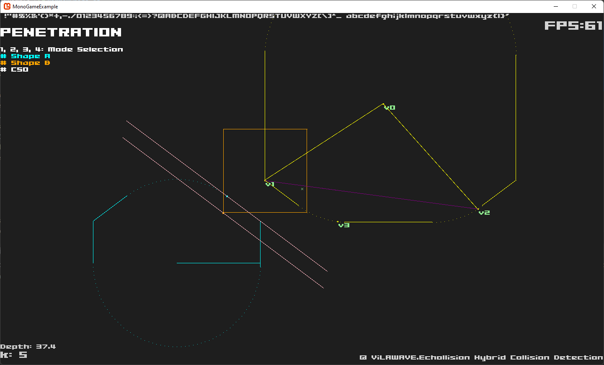

# Echollision
Hybrid 2D collision detection for .NET platforms.

## Features
- Support mapping based collider definition.
- Narrow phase collision detection.
  - Intersection testing.
  - Distance query.
  - Continuous/Priori detection.
  - Penetration detection.
- Broad phase collision detection.

## Example

## Target Platforms
- .NET Standard 2.0
- .NET Core 3.1
